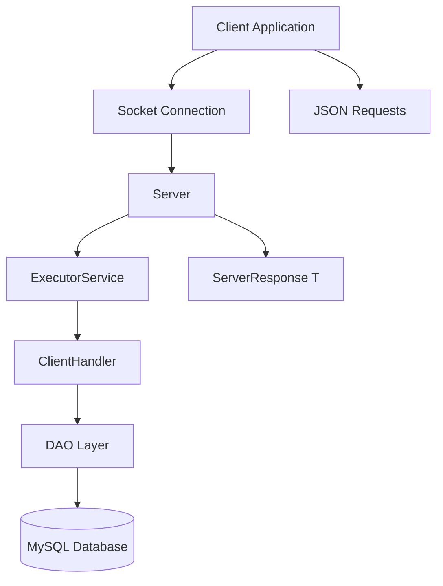

# 2025-26 - L8 - Y2 - OOP - G-CA2 - Project-Group-16

# Global Music Production Hub

---

# 1. Project Overview

## Domain Summary

The Music Production Hub is a digital platform designed for music producers, artists, and recording studios to manage music tracks and related production data. The system provides a centralized database for storing music tracks, producer information, and binary audio files with metadata. Users can upload, retrieve, update, and delete music tracks while maintaining structured records of music production activity.

The platform supports binary file handling through MySQL BLOB storage, allowing audio files such as MP3 or WAV files to be uploaded and retrieved between the client and server. Associated metadata including filename, content type, and file size is stored alongside the binary data to improve file management and retrieval efficiency.

The application uses a client-server architecture with JSON-based communication over sockets. Requests are processed through a multithreaded server using ExecutorService, while DAO classes provide database access through JDBC and PreparedStatements. The project demonstrates object-oriented programming concepts including interfaces, generics, collections, functional interfaces, and JSON serialization/deserialization. Comprehensive JUnit 5 testing ensures reliability across DAO operations, JSON conversion, server request handling, and binary file functionality.

---

## Team

* **Group ID:** `2025-26---L8---Y2---OOP---G-CA2---Project-Group-16`

### Members

* **Daniel Vincent** — `D00280851`
* **Kamil Seidou**

---

## Key Features

* JDBC DAO layer with full CRUD operations
* Client-server communication using sockets and JSON
* Generic `ServerResponse<T>` wrapper
* Multithreaded server using `ExecutorService`
* Binary file upload and retrieval using MySQL BLOB storage
* Metadata-only retrieval without loading binary payloads
* JUnit 5 test suite with integration and coverage validation

---

# 2. How to Run

## Prerequisites

* Java 21+
* IntelliJ IDEA or VS Code
* MySQL Server 8.0+
* Maven 3.9+

---

## 2.1 Database Setup

Create the database:

```sql
CREATE DATABASE musichub;
```

Run the setup script:

```bash
mysql -u root -p musichub < sql/create_table.sql
```

Verify tables:

* `music_tracks`
* `music_producers`

---

## 2.2 Configure Credentials

Create:

```text
src/main/resources/db.properties
```

Add:

```properties
db.url=jdbc:mysql://localhost:3306/musichub
db.user=your_username
db.password=your_password
```

---

## 2.3 Run the Server

Main class:

```text
musichub.server.Server
```

Command:

```bash
mvn exec:java -Dexec.mainClass="musichub.server.Server"
```

Expected output:

```text
Server listening on port 5000
```

---

## 2.4 Run the Client

Main class:

```text
musichub.client.TestClient
```

Command:

```bash
mvn exec:java -Dexec.mainClass="musichub.client.TestClient"
```

---

# 3. Architecture Summary

## 3.1 N-tier Overview

* **Client Layer:** Sends requests and displays responses
* **Server Layer:** Handles socket connections and request routing
* **DAO Layer:** JDBC persistence layer
* **Database Layer:** MySQL relational database with BLOB storage

---

## 3.2 Architecture Diagram



---

# 4. JSON Protocol Documentation

## 4.1 Envelope Format

Example response structure:

```json
{
  "status": "SUCCESS",
  "message": "Tracks fetched successfully",
  "data": {}
}
```

---

## 4.2 Supported Request Types

| Request Type      | Description                     |
| ----------------- | ------------------------------- |
| `GET_ALL`         | Fetch all music tracks          |
| `GET_BY_ID:id`    | Retrieve a music track by ID    |
| `INSERT:json`     | Insert a new music track        |
| `UPDATE:json`     | Update an existing music track  |
| `DELETE:id`       | Delete a music track            |
| `UPLOAD:json`     | Upload binary audio file        |
| `GET_METADATA:id` | Retrieve metadata only          |
| `DISCONNECT`      | Close client connection cleanly |

---

# 5. Binary File Handling (Stage 3+)

## 5.1 Binary Data in the Domain

Binary data represents uploaded music/audio files stored in the database.

---

## 5.2 Database Storage

The `music_tracks` table contains:

* `audioFile` BLOB
* `file_name` VARCHAR
* `content_type` VARCHAR
* `file_size` INT

---

## 5.3 Binary Operations

| Operation      | Description                               |
| -------------- | ----------------------------------------- |
| Upload         | Client Base64-encodes file and sends JSON |
| Retrieve       | Server returns Base64-encoded file        |
| Metadata Query | Retrieves filename/type/size only         |

---

# 6. Testing & Coverage

## 6.1 Running Tests

Command:

```bash
mvn test
```

---

## 6.2 Test Categories

* DAO tests
* JSON serialization tests
* ClientHandler/server tests
* Binary upload/retrieval tests
* Integration tests

---

## 6.3 Coverage Evidence

Coverage was generated using the IntelliJ IDEA coverage runner and stored in:

```text
/reports/coverage.png
```

Coverage target achieved:

* **>=70% line coverage**

Coverage includes:

* DAO layer classes
* JSON conversion utilities
* Binary file handling methods
* ClientHandler request processing

---

# 7. Design Patterns, Generics, Lambdas

## 7.1 Patterns Used

* DAO Pattern
* Factory-style database connection management
* Template Method style JDBC workflow

---

## 7.2 Generics

* `ServerResponse<T>`
* `Optional<T>`
* `List<T>`

---

## 7.3 Lambdas / Functional Interfaces

* `Predicate<MusicTrack>`
* Java Stream API filtering

---

# 8. Screencast (Stage 4)

## Filename

```text
2025-26-L8-OOP-GCA2-Project-Group-16
```

## Duration

* 8–10 minutes

## Demonstrates

* CRUD operations
* Binary upload/retrieval
* Tests running
* Coverage report
* Architecture explanation
* DAO layer walkthrough
* JSON conversion
* Client-server request handling

---

# 9. Contribution Matrix

| Task                                  | Primary Author | Contributor    |
| ------------------------------------- | -------------- | -------------- |
| Database schema and setup             | | Kamil Seidou   |Daniel Vincent 
| DAO layer implementation              | Kamil Seidou   | Daniel Vincent |
| JSON utilities and Gson configuration | Daniel Vincent | Kamil Seidou   |
| Client-server communication           | Daniel Vinent   | Kamil Seidou  |
| Binary file upload/retrieval          | Daniel Vincent | Kamil Seidou   |
| JUnit 5 testing suite                 | Kamil Seidou   | Daniel Vincent |
| README documentation                  | Daniel Vincent | Kamil Seidou   |
| Final debugging and integration       | Kamil Seidou| Daniel Vincent   |

---

# 10. References (Harvard)

1. Oracle. (2024) *JDBC API Documentation*. Available at: https://docs.oracle.com/en/java/javase/21/docs/api/java.sql/java/sql/package-summary.html (Accessed: 8 May 2026).

2. MySQL. (2024) *MySQL Connector/J Developer Guide*. Available at: https://dev.mysql.com/doc/connector-j/8.0/en/ (Accessed: 8 May 2026).

3. Google. (2024) *Gson User Guide*. Available at: https://github.com/google/gson/blob/master/UserGuide.md (Accessed: 8 May 2026).


4. OpenAI. (2026) *Response generated using ChatGPT regarding Java BLOB handling and testing*. Available at: https://chat.openai.com (Accessed: 8 March 2026).

5. Blackbox AI. (2026) *AI-assisted responses relating to Java JDBC, JSON handling, and testing*. Available at: https://www.blackbox.ai (Accessed: 9 March 2026).

---

# 11. AI Tool Use Declaration

## Tools Used

* ChatGPT
* Blackbox AI

---

## What Was Generated

* Boilerplate DAO structures
* Test method skeletons
* JSON utility templates
* Initial server architecture ideas

---

## What Was Modified By The Team

* Business logic implementation
* Database schema design
* Validation and error handling
* Binary file upload/retrieval workflow
* Testing and debugging
* Integration and architecture decisions
* README documentation and protocol design
